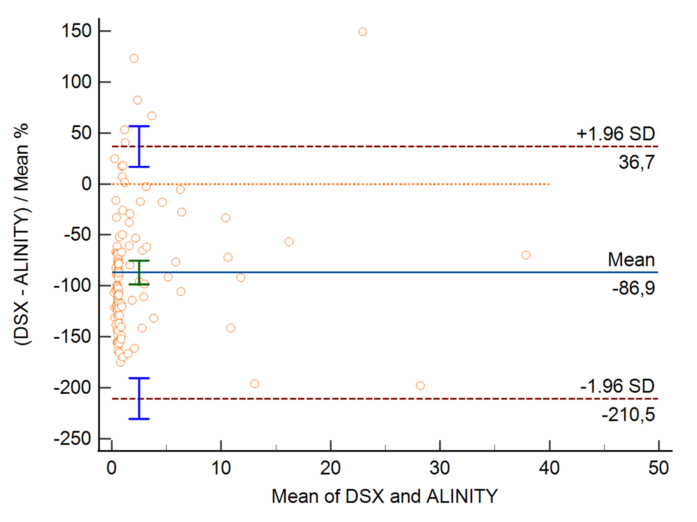

# 🔬 TRAb Cross-Instrument Normalization System

## Overview
During my thesis work, I conducted a comparative evaluation of an ELISA method for the measurement of TRAb (TSH receptor antibodies) against two chemiluminescence immunoassays and one TRACE-based method.

The initial goal was to identify the best instrument to replace the existing ELISA method due to performance limitations. However, the decision could not rely solely on analytical performance. It was also necessary to ensure **result comparability with historical data**, in order to:
- preserve patient clinical history  
- avoid misinterpretation by clinicians  

This constraint highlighted a key problem: even when methods are calibrated against the same international standard (NIBSC 08/204), they often produce **numerically non-comparable results**.

This leads to:
- Discontinuity in patient clinical history  
- Difficulty in interpreting results across laboratories  
- Instrument-dependent diagnostic thresholds

To address this, the project proposes a **latent-variable normalization framework** that allows all instruments to produce results on a **shared, comparable scale**, enabling instrument selection based purely on performance.

---

## Objective
- Harmonize TRAb measurements across multiple instruments  
- Provide a **common latent score** independent of the platform  
- Improve clinical interpretability and longitudinal consistency  

---

## Methodology

### 1. Latent Variable Extraction
- Apply **Principal Component Analysis (PCA)** on multi-instrument data  
- Extract the first principal component (PC1) as a **shared latent variable (gold standard)**  

### 2. Instrument-Specific Mapping
- Train a **Random Forest Regressor** for each instrument  
- Learn a non-linear mapping from raw measurements to the latent space

### 3. Inference
- Any new measurement, regardless of the instrument, is projected into the **latent space**  
- Results become directly comparable across platforms  
